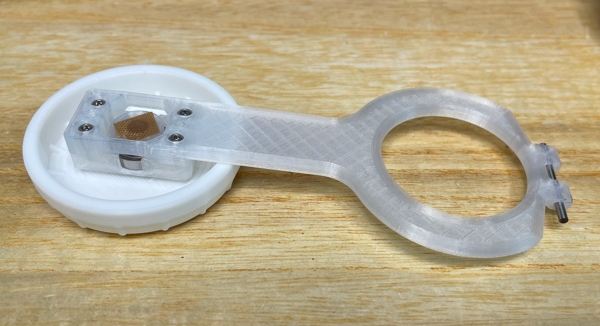

# Bishi Pico - Bishi Bashi Channel Style Mini Controller
[点这里可以切换到中文版](README_CN.md)

Features:
* It's small but closely replicates the feel of the arcade controller.
* Can be daisy-chained up to 4 controllers.
* Full HID light support.
* 3 color themes for the old Bishi Bashi title, the new Bishi Bashi Channel and the Love Live After School Activity.
* Command line for configurations.
* All source files open.

Thanks to many respectful guys/companies who made their tools or materials free or open source (KiCad, OnShape, InkScape, Raspberry things).

Special thanks to community projects and developers.
And also these projects:
* RP_Silicon_KiCad: https://github.com/HeadBoffin/RP_Silicon_KiCad
* Type-C: https://github.com/ai03-2725/Type-C.pretty

## About the License
It's CC-NC. So DIY for yourself and for your friend for free, don't make money from it. And plagiarism that doesn’t even dare to mention the original author is not acceptable. Plase note that pooling orders and group buying for raw materials is acceptable. Selling off any leftover components without profit is also acceptable.

If you're interested in buying from me or some kind of commercial use, please contact me (Discord, QQ group, Wechat group or leave your contact in issue section).

## My Discord Invitation
https://discord.gg/M8f2PPQFEA

## My Other Projects
You can check out my other cool projects.

            

* Popn Pico: https://github.com/whowechina/popn_pico
* IIDX Pico: https://github.com/whowechina/iidx_pico
* IIDX Teeny: https://github.com/whowechina/iidx_teeny
* Chu Pico: https://github.com/whowechina/chu_pico
* Mai Pico: https://github.com/whowechina/mai_pico
* Diva Pico: https://github.com/whowechina/diva_pico
* AIC Pico: https://github.com/whowechina/aic_pico
* Groove Pico: https://github.com/whowechina/groove_pico
* Geki Pico: https://github.com/whowechina/geki_pico
* Musec Pico: https://github.com/whowechina/musec_pico
* Ju Pico: https://github.com/whowechina/ju_pico
* Bishi Pico: https://github.com/whowechina/bishi_pico

## **Disclaimer** ##
I made this project in my personal time. I will continue to improve the project. I have done my best to ensure that everything is accurate and functional, there's always a chance that mistakes may occur. I cannot be held responsible for any loss of your time or money that may result from using this open source project. Thank you for your understanding.

## HOW TO BUILD
### PCB and Components
* Go JLCPCB and make order with the gerber zip files (latest `Production\PCB\bishi_pico_xxx.zip`), regular FR-4 board, black color, **1.6mm** thickness.

You may need to build 2 to 4 controllers for a pary. For each controller:
* 1x Rasberry Pico Pi Pico or pin-to-pin compatible clones.  
  https://www.raspberrypi.com/products/raspberry-pi-pico
* 3x USB Type-C socket (918-418K2023S40001 or KH-TYPE-C-16P)
* 16x WS2812B-3528 RGB LEDs.
* 6x WS2812B-4020 RGB LEDs (side facing).
* 1x TMAG5273A1 or TMAG5273A2, in SOT23-6.
* 4x 0603 0.1uF (0.1~1uF all fine) capacitors.
* 4x 0603 5.1kohm resistors.
* 2x JST-SH1.0 4-pin right angle SMD connectors.  
  https://www.amazon.com/Keszoox-Adapter-Connector-Surface-KS-SH1-0-SMT-R/dp/B0D793LSV2
* 1x JST-SH1.0 dual-end 4-pin cables, 50-80mm length, pin-to-pin alignment.
  The connector footprint on PCB also supports hand soldering. So if you can't find the connectors or the cables, you can solder the wires directly to the PCB.  
  RC hobby sites often have SH1.0 4P silicone cables, but with only one end connector. You can solder the other end to the PCB. It's still a good choice.
* 1x Kailh Choc v1. Choose heavy ones (70gf), I think the yellow with 70g force is the best.  
  
* 3x MX-compatible switch, I personally use Gateron POM CJ BOX.
* Optional: 6x ESD diodes, SOD-323, 3.3V bidirectional.
* This is how it looks after soldering.  
    
  
* Becareful of 2 pin holes. It's a common oversight to either forget to solder them or to leave air bubbles during the process. To avoid this, solder slowly from one side of the hole, using minimal solder wire and a generous amount of flux.  
  

### Test the PCB
* You can test the PCB now, put the firmware in.
* Most LEDs should light up.
* LEDs respond to the button presses.
* Bishi Pico should be recognized as a USB HID device, here's the test page.  
  https://greggman.github.io/html5-gamepad-test/
* Move a magnetic screwdriver tip close to the TMAG5273 sensor, you'll notice the corresponding axis move in the test page.

### Sensor PCB Separation
* If everthing works fine, you can cut off (or even bend and snap) the small sensor board from the main board.  
  

### 3D Printing
#### Printing parameters  
* PLA or PETG.
* Layer height: 0.2mm
* Wall: >= 4.
* Support: Yes, always, but only on bed and no need for bridges.
* Glue on bed: Yes, it prevents corner warping.
* Files are always in milimeter unit, not inch.

#### 1x Spinner Parts
* Keycap: `Production\3DPrint\bishi_keycap.stl`, white, 5 walls or >=90% infill. If you have multi-color system, print the 4 triangle marks on the top in gray. 
* Bearing Fixer: `Production\3DPrint\bishi_bearing_fixer.stl`, clear transparent.
* Magnet Seat: `Production\3DPrint\bishi_mag_seat.stl`, clear transparent, choose the one matches your magnet size.
* Lever: `Production\3DPrint\bishi_lever.stl`, clear transparent.
* Plase pay attention to the orientation of the parts.  

#### Housing Parts
* Base: `Production\3DPrint\bishi_base.stl`, gray, if you have multi-filament system, use special support material for nicer screw hole surface.
* Middle Support: `Production\3DPrint\bishi_support.stl`, clear transparent.
* Panel: `Production\3DPrint\bishi_panel.3mf`, gray, print up-side-down. If you have multi-filament system, print the logo and lines in black.

#### 3x Button Seats
* Button Seat: `Production\3DPrint\bishi_button_seat.stl`, white, print upside down.

### Assembly
#### Other components needed
* 3x Chirstmas tree clear plastic balls, 30mm diameter. They come in 2 half-balls, we only need the shorter one.  
  https://www.amazon.com/Plastic-Fillable-Ornaments-Acrylic-Christmas/dp/B09ZTSGL28/
* 1x **M2.5\*6mm screws** for fixing the keycap to the bearing.
* 6x **M2\*8mm screws** for fixing the bearing and the sensor PCB to the lever.
* 6x **M3\*12mm screws** for fixing the housing parts together.
* 1x 6700zz (10x15x4mm) bearings for the spinner, just buy cheapest ones. They may come packed with a heavy weight oil that arrests rotation, this can be corrected by thoroughly degreasing the bearings and relubricating them with a lightweight oil like Super Lube ISO 68. For example, a soak and spin in 99% isopropyl alcohol, dry on a heated plate to remove the excess alcohol and thin and remaining grease, then a final wash in acetone (if you have all-metal bearings) and additional heated dry before relubricating will ensure the bearings spin freely.
  https://www.amazon.com/uxcell-6700ZZ-Groove-Bearings-Shielded/dp/B082PPYZQX/
* 1x round magnet, 5mm diameter (4mm also works if you stick it well), 1.5mm or 2mm tall, MUST be radially/diametrically magnetized (N-S poles on the curved side).  
  https://wargameportal.com/products/special-diametrically-magnetized-50pcs-5mm-x-2mm-3-16-x-1-16-disc-magnets?variant=49014932209942
* 1x 25mm length 2mm diameter steel shafts for the lever.  
  https://www.walmart.com/ip/Unique-Bargains-RC-Toy-Car-Frame-Part-Stainless-Steel-Round-Rod-Shaft-25mm-x-2mm-40-Pcs/108734138?wmlspartner=wlpa&selectedSellerId=571
* Some good tape (such as acetate tape or high-temp teflon tape) to fix the magnets in place.
* PTFE or UHMW tape for the sliding surfaces.
* Silicone anti-slip pads (10-12mm diameter) for the bottom.  
  
* Clear soft/flexible glue or UV curing glue. WARNING: Avoid using any cyanoacrylate-based glue, such as 502. Any glue with a similar smell should also be avoided, as they will leave white smoke marks on the acrylic.
* Optional but good to have: plastic washer (ring pads), 0.5mm thick, 2.1~2.5mm inner diameter, 5-10mm outer diameter.  
  https://www.amazon.com/Bclla-Zkenshan-washers-Shock-Proof-Leak-Proof-Insulation/dp/B091Y7H9NX/

#### Steps
1. We'll make 3 dome buttons first. Just glue the shorter half of the clear plastic ball onto the button seat use the glue mentioned earlier.
   
  
2. Now the spinner part. Insert the bearing into the bearing fixer while keeping the components warm. You can use a hair dryer to heat them up a little. Then screw the lever and the bearing fixer together using M2 screws. Then screw the keycap to the bearing using the M2.5 screw and the magnet seat. Screw very very slowly so it won't heat up and break the 3D printed parts. Put the magnet into the magnet seat and fix it with tape. Lastly put in the shaft steel into the lever. You may also look at the Musec Pico (https://github.com/whowechina/musec_pico) for spinner assembly.
   

3. Connect the SH1.0 cable to the sensor PCB. And mount the PCB and the lever to the base. A pair of plastic washer will be helpful to prevent the lever from moving. They can also be used to adjust the lever position, compensating for the printing tolerance.  
   

4. Connect the other side of the SH1.0 cable to the mainboard and put all 3 dome buttons and the support part on. We're almost there. Connect to a PC and do a final test before we screw the panel.    
   

5. Install the panel using M3 screws. Put anti-slip pads on the bottom, right on top of the screws.

#### Caution
* Each 3D printer and filament has its own tolerance. If you find the stem holes on the button are too tight, use some needle or knife to enlarge them a little bit.
* Screws are easy to break the 3D printed parts. So don't screw them too fast or too tight. When you notice the resistance suddenly increases, stop screwing.

### Firmware
* UF2 file is in `Production\Firmware` folder.
* For the new build, hold the BOOTSEL button while connect the USB to a PC, there will be a disk named "RPI-RP2" showed up. Drag the UF2 firmware binary file into it. That's it. There's a small hole at the bottom side of the Bishi Pico, it is facing right to the BOOTSEL button.
* If it's already running Bishi Pico firmware, you can either use "update" in command line or hold down all 4 buttons while connecting to USB to enter update mode.
* To access the command line, you can use this Web Serial Terminal to connect to the command line port of the controller. (Note: "?" is for help)  
  https://googlechromelabs.github.io/serial-terminal/

### Usage
* It's very simple. Just plug it in and play.
* The top type-C port is for USB connection. The left one is for daisy-chaining uplink, the right one is for daisy-chaining downlink.
* When in the daisy-chain, each controller will identify itself and change its cab color correspondingly. The first one that connects to the PC is the master (P1).
* Connect USB while pressing the spinner enters Bishi Bashi Channel theme; connect USB while pressing the middle button enters the old Bishi Bashi theme; connect USB while pressing the left and right buttons enters the Love Live theme.
* You can set spin sensivity by "spin rate" command.
* You can set spin direction by "spin <normal|reverse>" command.
* You can set the LED brightness by "level" command.
* Other than the spin direction, all settings are synced from the master to downstream controllers in the chain.

## CAD Source File
I'm using OnShape free subscription. It's powerful but it can't archive original designs to local, so I can only share the link here. STL/DXF/DWG files are exported from this online document.  
  https://cad.onshape.com/documents/6f83a021410e82d07cc15922/w/bf90a7bd098b65b3b6359caa/e/e7d515c69c3b65443d3da058
