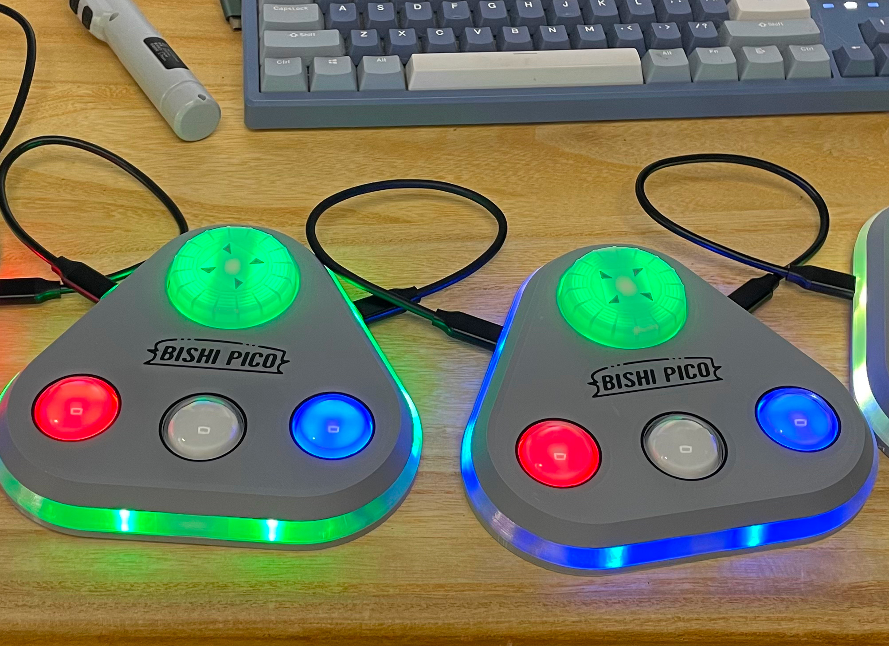
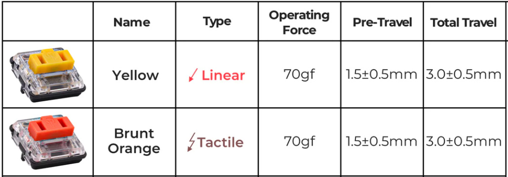
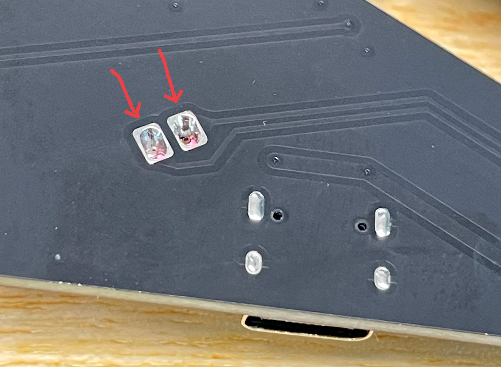
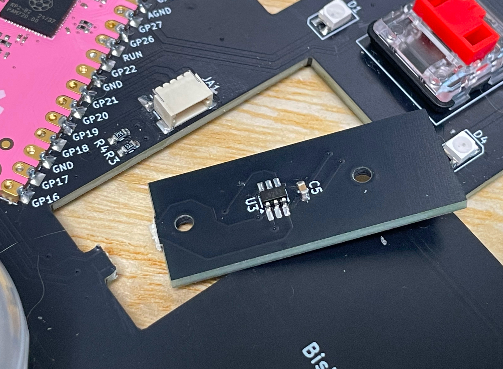
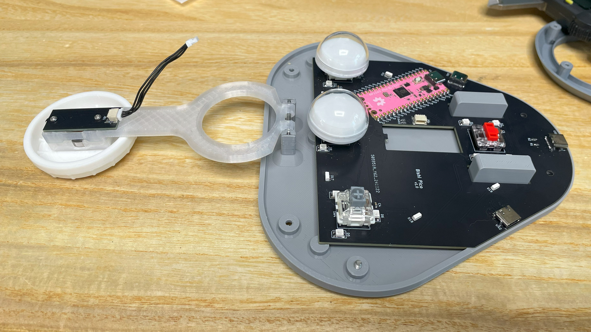

# Bishi Pico - 拍打乐风格的迷你控制器
[Click here for the English version of this guide.](README.md)

## 特性
* 它很小，但尽量还原街机控制器的感觉。
* 可以最多四台级联。
* 完整的 HID 灯光支持。
* 三种颜色主题，分别是旧版拍打乐，新版拍打乐频道和 Love Live 学园活动。
* 命令行配置。
* 所有源文件开放。

感谢许多尊敬的爱好者和公司将他们的工具或材料免费或开源（KiCad，OnShape，InkScape，Raspberry 相关工具, 嘉立创，等）。

特别感谢社区项目和开发者的帮助，还有如下项目：
* RP_Silicon_KiCad: https://github.com/HeadBoffin/RP_Silicon_KiCad
* Type-C: https://github.com/ai03-2725/Type-C.pretty

## 关于许可证
它是 CC-NC 授权。所以你只能给自己和或者免费给你的朋友 DIY，不能利用这个项目赚钱，比如收费的代做，出售整机等，连源作者都不敢提的抄袭或者稍微改改换个名字来打擦边球就更不可以了。注意团购和拼单订购原始元器件是合理的，非盈利的方式卖掉剩余的元器件也是可以接受的。

如果希望找我购买成品或者寻求商用授权，请联系我（Discord，QQ 群，闲鱼，微信群或者在 issue 区留下你的联系方式）。

## 我的 Discord 服务器邀请
https://discord.gg/M8f2PPQFEA

## 其他项目
你也可以查看我其他的酷炫项目。

            

* Popn Pico: https://github.com/whowechina/popn_pico
* IIDX Pico: https://github.com/whowechina/iidx_pico
* IIDX Teeny: https://github.com/whowechina/iidx_teeny
* Chu Pico: https://github.com/whowechina/chu_pico
* Mai Pico: https://github.com/whowechina/mai_pico
* Diva Pico: https://github.com/whowechina/diva_pico
* AIC Pico: https://github.com/whowechina/aic_pico
* Groove Pico: https://github.com/whowechina/groove_pico
* Geki Pico: https://github.com/whowechina/geki_pico
* Musec Pico: https://github.com/whowechina/musec_pico
* Ju Pico: https://github.com/whowechina/ju_pico
* Bishi Pico: https://github.com/whowechina/bishi_pico

## **声明** ##
我在个人业余时间内制作了这个项目，并将继续改进这个项目。我已尽我所能确保所有内容的准确性和功能性，但总有可能出现错误。如果你因使用这个开源项目而造成时间或金钱的损失，我不能负责。感谢你的理解。

## 如何制作
### PCB 和元器件
* 去 JLCPCB 或者其他 PCB 供应商下单，使用最新的 `Production\PCB\bishi_pico_xxx.zip` gerber 文件，选择常规 FR-4 板材，黑色或白色，**1.6mm** 厚度。

你可能需要做 2 到 4 个控制器。每个控制器需要：
* 1x Rasberry Pico Pi Pico 或者兼容的克隆板。   
  https://www.raspberrypi.com/products/raspberry-pi-pico
* 3x USB Type-C 插座 (918-418K2023S40001 或 KH-TYPE-C-16P)。
* 16x WS2812B-3528 RGB LED。
* 6x WS2812B-4020 RGB LED (侧面发光)。
* 1x TMAG5273A1 或 TMAG5273A2, SOT23-6 封装。
* 4x 0603 0.1uF 电容 (0.1~1uF 都可以) 。
* 4x 0603 5.1kohm 电阻。
* 2x JST-SH1.0 4P 卧式贴片插座。  
  https://www.amazon.com/Keszoox-Adapter-Connector-Surface-KS-SH1-0-SMT-R/dp/B0D793LSV2
* 1x JST-SH1.0 双头排线，50-80mm 长度, 引脚对齐，国内卖家经常叫做双头反向。  
  插座焊盘也支持手工焊接。所以如果找不到插头或者排线，你可以直接焊线到 PCB 上。
  模型飞机或者无人机的配件网站经常有 SH1.0 4P 的硅胶线，但只有一端插头。你可以把另一端焊接到 PCB 上。这也是一个不错的选择。
* 1x 凯华 Choc v1 重力轴(70gf)，图中两种颜色均可。  
  
* 3x MX 兼容键轴，我个人喜欢嘉达隆的 CJ BOX。
* 可选：6x ESD 二极管, SOD-323 封装, 3.3V 双向。

* 焊接完成后的效果。  
    
  
* 注意这两个引脚的焊接，很容易疏忽，要么忘记焊，要么在过程中留下气泡。为了避免这种情况，从孔的一侧开始慢慢焊接，要用尽量少的焊丝和较多的助焊剂。  
  

### 测试 PCB
* 现在你可以测试 PCB 了，把固件烧录进去。
* 大部分 LED 应该会亮起。
* 按钮按下后，对应的 LED 会响应。
* Bishi Pico 应该被识别为 USB HID 设备，这里是测试页面。  
  https://greggman.github.io/html5-gamepad-test/
* 将磁性螺丝刀头靠近 TMAG5273 传感器，你会看到测试页面上对应的轴会有反应。

### 传感器 PCB 分离
* 如果一切正常，你可以把小传感器板从主板上切下来（甚至直接掰下来）。
  

### 3D 打印
#### 打印参数  
* PLA 或 PETG.
* 层高: 0.2mm.
* 墙: >= 4.
* 支撑: 需要，仅在热床上生成，没必要为桥接支撑。
* 热床上涂胶水: 是的，可以防止角部翘曲。
* 文件都是以毫米为单位，不是英寸。

#### 1x 转盘按钮部分
* 键帽: `Production\3DPrint\bishi_keycap.stl`, 白色，5 层墙或者 90% 以上填充率。如果你有多色打印系统，可以用灰色打印顶部的 4 个三角标记。
* 轴承固定器: `Production\3DPrint\bishi_bearing_fixer.stl`, 透明。
* 磁铁座: `Production\3DPrint\bishi_mag_seat.stl`, 透明。
* 平衡杆: `Production\3DPrint\bishi_lever.stl`, 透明。
* 请注意打印的时候的摆放朝向。  

#### 外壳部分
* 基座: `Production\3DPrint\bishi_base.stl`, 灰色，如果你有多色打印系统，使用特殊支撑材料以获得更好的螺丝孔表面。
* 中框: `Production\3DPrint\bishi_support.stl`, 透明。
* 面板: `Production\3DPrint\bishi_panel.3mf`, 灰色，如果你有多色打印系统，用黑色打印 logo 和线条部分。

#### 3x 按钮座
* 按钮座: `Production\3DPrint\bishi_button_seat.stl`, 白色，倒过来打印。

### 组装
#### 需要的其他部件
* 3x 30mm 直径的透明塑料小球，一般用于圣诞树装饰。一般是由两个半边组成，我们只需要矮的半边。  
  https://www.amazon.com/Plastic-Fillable-Ornaments-Acrylic-Christmas/dp/B09ZTSGL28/
* 1x **M2.5\*6mm 螺丝** 用于将键帽固定到轴承上。
* 6x **M2\*8mm 螺丝** 用于把轴承和传感器 PCB 固定到平衡杆上。
* 6x **M3\*12mm 螺丝** 用于固定外壳。
* 1x 6700zz (10x15x4mm) 轴承用于转盘，买最便宜的就行。如果你买到的轴承阻尼很大很难转动，你需要人工把轴承里面的润滑油（阻尼油）擦干净，然后加入适量的润滑脂。  
  https://www.amazon.com/uxcell-6700ZZ-Groove-Bearings-Shielded/dp/B082PPYZQX/
* 1x 圆形磁铁，直径 5-7mm（3mm 或 4mm 也可以，只要你有办法粘住就好），高度 1.5mm 或 2mm，必须是径向/直径磁化的（N-S 极在弧面一侧）。  
  https://wargameportal.com/products/special-diametrically-magnetized-50pcs-5mm-x-2mm-3-16-x-1-16-disc-magnets?variant=49014932209942
* 1x 25mm 长 25mm 直径 2mm 的钢轴用于平衡杆。  
  https://www.walmart.com/ip/Unique-Bargains-RC-Toy-Car-Frame-Part-Stainless-Steel-Round-Rod-Shaft-25mm-x-2mm-40-Pcs/108734138?wmlspartner=wlpa&selectedSellerId=571
* 一些好的胶带（如醋酸胶带或高温聚四氟乙烯胶带）用于固定磁铁。
* 用于滑动表面的 PTFE 或 UHMW 胶带。
* 底部的硅胶防滑垫。  
  
* 透明软性胶或者 UV 固化胶。警告：避免使用任何氰基胶，比如 502 胶。任何有类似气味的胶也要避免，因为它们会在亚克力上留下白色雾化痕迹。
* 可选，但很有用：硬塑料垫片（环垫），0.5mm 厚，2.1~2.5mm 内径，5-10mm 外径。
  https://www.amazon.com/Bclla-Zkenshan-washers-Shock-Proof-Leak-Proof-Insulation/dp/B091Y7H9NX/

#### 步骤
1. 我们先做 3 个圆形按钮。先把透明塑料小球的矮半边用之前提到的胶水粘到按钮座上。  
   
2. 然后是转盘部分。把轴承插入轴承固定器，注意让打印件暖和一点。你可以用吹风机稍微加热一下。然后用 M2 螺丝把平衡杆和轴承固定器固定在一起。然后用 M2.5 螺丝把磁铁座和键帽固定到轴承上。要拧的非常慢，以免发热弄坏 3D 打印部件。把磁铁放到磁铁座里，用胶带固定。最后把钢轴插入平衡杆。你也可以参考 Musec Pico (https://github.com/whowechina/musec_pico) 的转盘组装部分。
   

3. 把 SH1.0 排线连接到传感器 PCB 上。然后把 PCB 和平衡杆装到底座上。用两个塑料垫片可以防止平衡杆移动。它们也可以用来调整平衡杆的位置，补偿打印公差。  
   

4. 把 SH1.0 排线的另一端连接到主板上，然后把 3 个圆形按钮和支撑部件装上。我们快要完成了。连接到 PC 上做最后的测试。  
   

5. 用 M3 按钮把面板装上，最后在底部装上硅胶防滑垫。  

#### 注意事项
* 每台 3D 打印机和打印材料都有自己的公差。如果你发现按钮上的十字孔太紧，可以用针或刀片稍微扩大一下。
* 螺丝很容易把 3D 打印部件弄坏。所以拧的时候要非常慢，不要拧太紧。感觉到阻力突然增大时就要特别小心了。

### 固件
* UF2 文件在 `Production\Firmware` 文件夹中。
* 对于首次烧录，按住 BOOTSEL 按钮连接到 USB，会出现一个名为 "RPI-RP2" 的磁盘。将 UF2 固件二进制文件拖入其中。Bishi Pico 的底部有一个小孔，它正对着 BOOTSEL 按钮。
* 如果已经烧录过 Bishi Pico 固件，你可以使用命令行中的 "update" 或者在插入 USB 的时候按住所有 4 个按钮来进入更新模式。
* 要访问命令行，你可以使用这个 Web 串口终端连接到 Bishi Pico 的命令行串口。（注意："?" 是帮助）  
  https://googlechromelabs.github.io/serial-terminal/

### 使用
* 非常简单。只要插上电源就可以玩了。
* 顶部的 Type-C 接口是用于 USB 连接的。左边的是级联上行，右边的是级联下行。
* 当级联时，每个控制器都会识别自己并相应地改变中框颜色。第一台连接到 PC 的控制器是主控制器（P1）。
* 按住转盘并插入 USB 进入 Bishi Bashi Channel 主题；按住中间按钮并插入 USB 进入旧版 Bishi Bashi 主题；按住左右按钮并插入 USB 进入 Love Live 主题。
* 你可以通过 "spin rate" 命令设置转盘灵敏度。
* 你可以通过 "spin <normal|reverse>" 命令设置转盘方向。
* 你可以通过 "level" 命令设置 LED 亮度。
* 除了转盘方向，所有设置都会从主控制器同步到级联下行的控制器。

## CAD Source File
我使用的是 OnShape 的免费订阅。它很强大，但不能将原始设计存档到本地，所以我只能在这里分享链接。STL/DXF/DWG 文件是从这个在线文档导出的。
  https://cad.onshape.com/documents/6f83a021410e82d07cc15922/w/bf90a7bd098b65b3b6359caa/e/e7d515c69c3b65443d3da058
